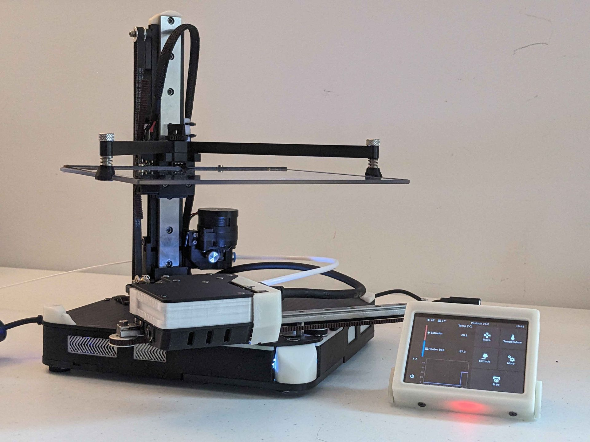
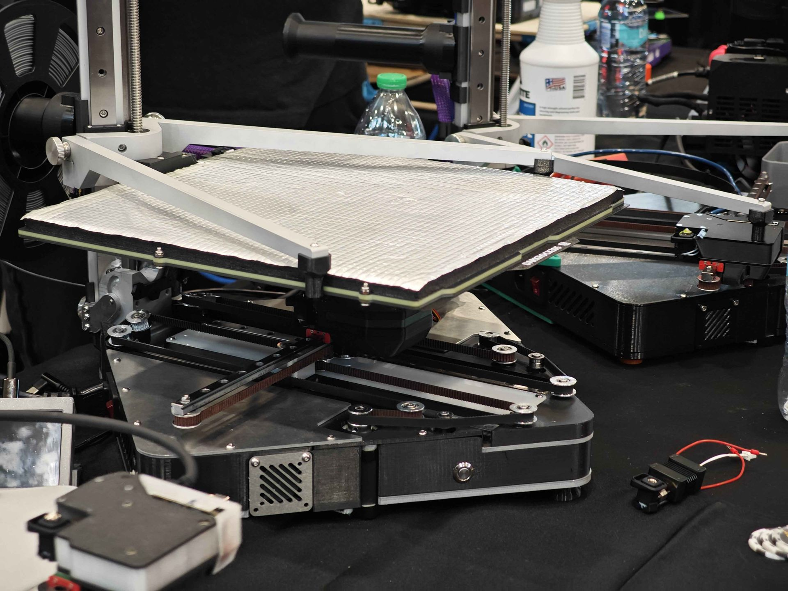
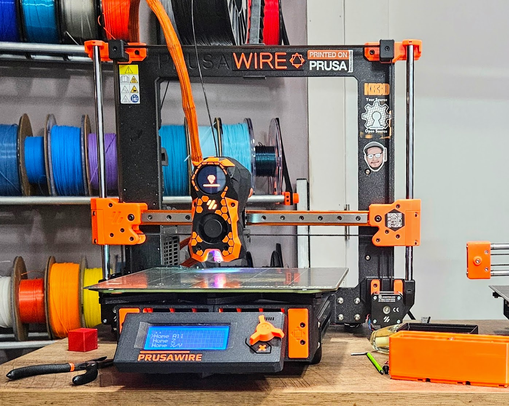

title: Formatting showcase
date: 2026-10-01
author: The Positron Team
summary: Every formatting feature the Positron blog supports, in one post.
cover: ../assets/img/printer-positron.jpg
tags: guide, formatting
draft: true

Copy this file to `Blog/YYYY-MM-DD-your-title.md`, change the lines at the top, and delete what you don't need. The lines at the top must stay first, with one blank line after them.

[TOC]

## Text

**Bold**, *italic*, ***both***, ~~strikethrough~~, ==highlight==, ^^inserted^^, H~2~O and E = mc^2^, `inline code`, ++ctrl+alt+p++ and a [link to the docs](../documentation.html). Bare URLs link themselves: https://positron3d.com. Emoji work too :rocket:.

> A blockquote, for quoting someone.
> It can run over several lines.

## Images with text wrap

{.right width=320}

Put `{.right}` or `{.left}` after an image and the text flows around it. Add `width=320` to set its size. This paragraph wraps around the printer on the right, and keeps going until the image ends, which is how you'd lay out a build log, a feature explainer or a review. On phones the image drops above the text at full width, so nothing gets squashed.

{.left width=260}

The same works on the left. Use `{.center}` for a centred image on its own, `{.wide}` for one that's wider than the text column, and `{.full}` for one that spans the whole column width. A new `##` heading always starts below any floating image.

## Images with captions

<figure class="center" markdown>
{width=560}
<figcaption>Wrap an image in a figure to give it a caption.</figcaption>
</figure>

## Lists

- Bullets
    - Nested with four spaces

1. Numbered
2. Lists

- [x] Task lists
- [ ] with checkboxes

Term
:   And a definition list for specs or glossaries.

## Tables

| Spec | Positron | Proton |
|:-----|:--------:|-------:|
| Build volume | 180 × 180 × 180 mm | 120 × 120 × 120 mm |
| Weight | 3.5 kg | 2 kg |

## Callouts

!!! note
    A plain note.

!!! tip "Pro tip"
    Callouts can have a custom title.

!!! warning
    Also `danger`, `success` and `info`.

??? info "Click to expand"
    A collapsible section. Use `???+` to start it open.

## Tabs

=== "Klipper"
    ```ini
    [printer]
    kinematics: corexy
    max_velocity: 300
    ```

=== "Marlin"
    ```c
    #define COREXY
    ```

## Code

```python
print("Fenced code blocks keep their formatting")
```

## Footnotes and abbreviations

The Positron fits in carry-on luggage.[^1] Use a STEP file for CAD.

[^1]: Tested through several major US airports.

*[STEP]: Standard for the Exchange of Product Data

## Video

Paste a YouTube embed wrapped in `<div class="video">` and it scales to the column (HTML is allowed in posts):

```html
<div class="video"><iframe src="https://www.youtube-nocookie.com/embed/VIDEO_ID" title="What the video shows" allowfullscreen></iframe></div>
```

---

A line of three dashes draws a divider.
